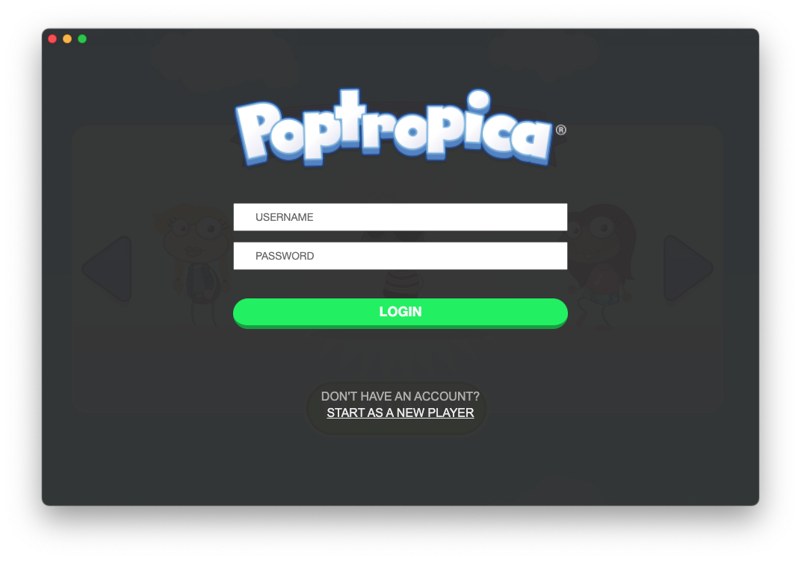
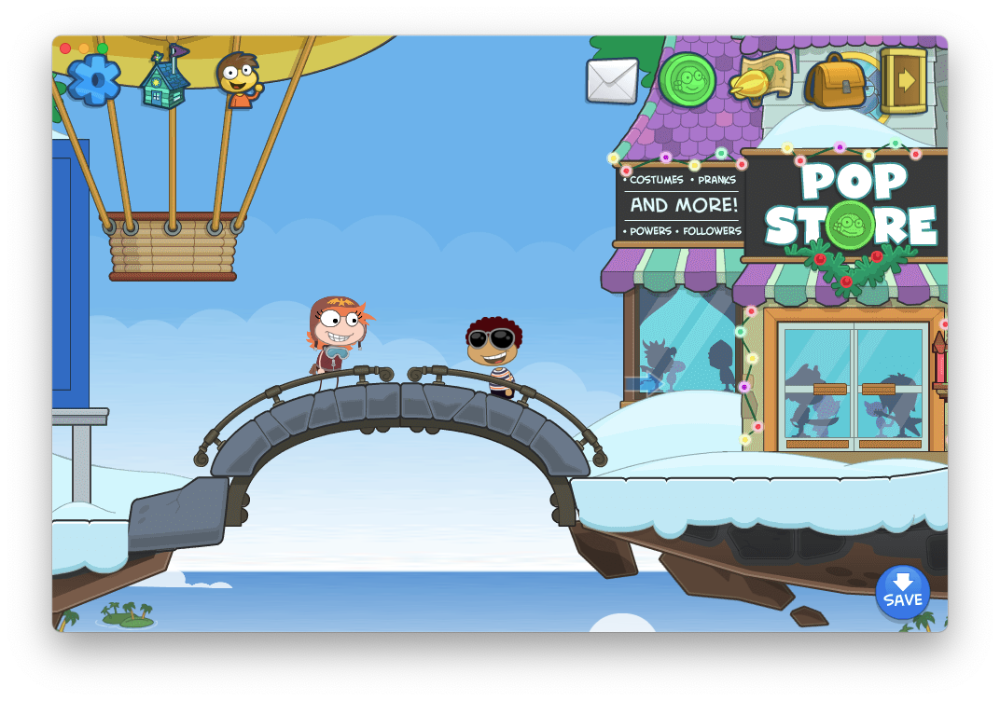
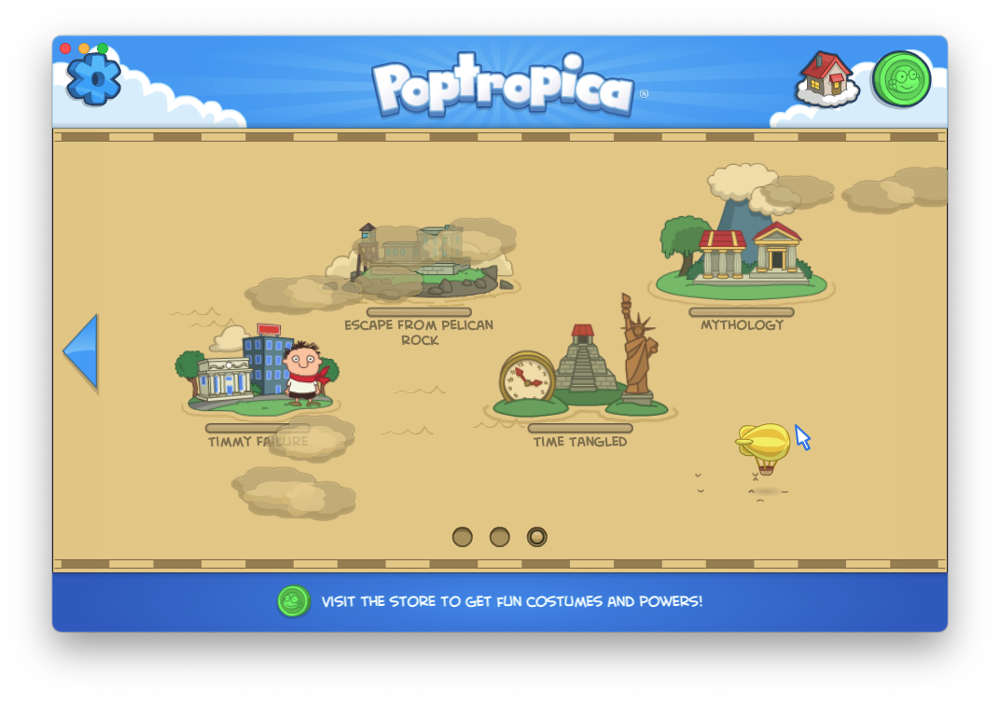

  

<h1 align="center">Poptropica Desktop</h1>

Play Poptropica in its own window, without banner & video ads, and with a streamlined login page!

#### Download the [Lastest Version](https://github.com/venashial/Poptropica-Desktop/releases/latest) for Windows, MacOS, and Linux
   
## Screenshots

## Privacy
Your login information is completely secure and only gets sent to poptropica.com. This application has no servers nor contacts any besides the ones required for playing Poptropica.

## Disclaimer
This project is not affiliated with StoryArc Media, Inc. so leave any issues or feature requests [here](https://github.com/venashial/Poptropica-Desktop/issues).
